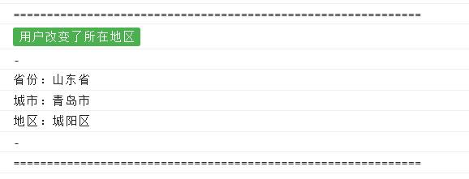
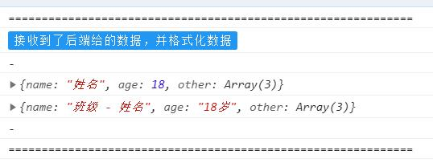
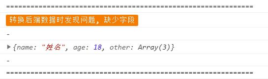
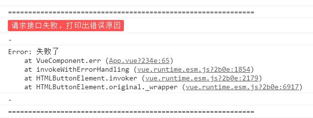

## 代码示例

```javascript
import { log } from 'jason-helper';

/**
 *  简易写法
 *  会通过 log 方式输出标题
 ***/
log('我是简短描述')

/**
 *  配置写法
 *  可选 log，info，warn，error 四种类型
 *  默认为 log 类型
 *  输出的主题色不一样
 ***/
log({
  title: '接收到了数据',
  desc: [ {}, {} ],
  type: 'log'
})

```

## 参数介绍

params | description
------ | ----------------------
title  | 日志标题, Number 或 String 类型
desc   | 日志内容，任何类型，若为 Array 类型，则每一项都是一行
type   | 日志类型，log，info，warn，err 四选一，默认是 log

## 样式



